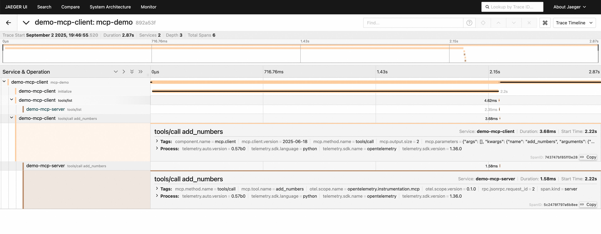

# OpenTelemetry MCP Instrumentation

MCP Python Agent provides observability for MCP client and MCP server.  
This document provides examples of usage and results in the MCP instrumentation.  
For details on usage and installation of LoongSuite and Jaeger, please refer to [LoongSuite Documentation](https://github.com/alibaba/loongsuite-python-agent/blob/main/README.md).

## Installing MCP Instrumentation

```shell
# Open Telemetry
pip install opentelemetry-distro opentelemetry-exporter-otlp
opentelemetry-bootstrap -a install

# mcp
pip install mcp==1.13.1

# MCPInstrumentor
git clone https://github.com/alibaba/loongsuite-python-agent.git
cd loongsuite-python-agent
pip install ./instrumentation-genai/opentelemetry-instrumentation-mcp
```

## Collect Data

Here's a simple demonstration of MCP instrumentation. The demo uses:

- An [MCP server](examples/simple_server.py) that provides an `add_numbers` tool
- An [MCP client](examples/simple_client.py) that connects to the server and calls the tool

### Running the Demo

#### Option 1: Using OpenTelemetry

```bash
export OTEL_INSTRUMENTATION_GENAI_CAPTURE_MESSAGE_CONTENT=true

opentelemetry-instrument \
--traces_exporter console \
--service_name demo-mcp-client \
python examples/simple_client.py
```

#### Option 2: Using Loongsuite

```bash
export OTEL_INSTRUMENTATION_GENAI_CAPTURE_MESSAGE_CONTENT=true

loongsuite-instrument \
--traces_exporter console \
--service_name demo-mcp-client \
python examples/simple_client.py
```

### Results

The instrumentation will generate traces showing the MCP operations:

```bash
Starting MCP Client...
Connection successful!
========================================
Getting available tools...
[09/01/25 15:57:53] INFO     Processing request of type ListToolsRequest                                                                                                                 server.py:624
Found 1 tools:
  - add_numbers:
    Add two integers together.

    Args:
        a: First integer
        b: Second integer

    Returns:
        Sum of the two numbers
    
========================================
Calling add_numbers tool...
                    INFO     Processing request of type CallToolRequest                                                                                                                  server.py:624
Tool call result:
  42
========================================
Demo completed!

{
    "name": "tools/call add_numbers",
    "context": {
        "trace_id": "0xcd90df6933f64384f5311ec1fa626bd1",
        "span_id": "0x287a0dd698d1a078",
        "trace_state": "[]"
    },
    "kind": "SpanKind.CLIENT",
    "parent_id": "0x7301d09643bee0a9",
    "start_time": "2025-09-02T11:50:45.156324Z",
    "end_time": "2025-09-02T11:50:45.159357Z",
    "status": {
        "status_code": "OK"
    },
    "attributes": {
        "component.name": "mcp.client",
        "mcp.method.name": "tools/call",
        "rpc.jsonrpc.request_id": "2",
        "mcp.client.version": "2025-06-18",
        "mcp.tool.name": "add_numbers",
        "mcp.parameters": "{\"args\": [], \"kwargs\": {\"name\": \"add_numbers\", \"arguments\": {\"a\": 15, \"b\": 27}}}",
        "network.transport": "stdio",
        "mcp.output.size": "2"
    },
    "events": [],
    "links": [],
    "resource": {
        "attributes": {
            "telemetry.sdk.language": "python",
            "telemetry.sdk.name": "opentelemetry",
            "telemetry.sdk.version": "1.36.0",
            "service.name": "demo-mcp-client",
            "telemetry.auto.version": "0.57b0"
        },
        "schema_url": ""
    }
}
```


After [setting up jaeger](https://www.jaegertracing.io/docs/1.6/getting-started/) and exporting data to it by following these commands:

```bash
export OTEL_INSTRUMENTATION_GENAI_CAPTURE_MESSAGE_CONTENT=true

loongsuite-instrument \
--exporter_otlp_protocol grpc \
--traces_exporter otlp \
--exporter_otlp_insecure true \
--exporter_otlp_endpoint YOUR-END-POINT \
python examples/simple_client.py
```

You can see traces on the jaeger UI as follows:  



## References

- [OpenTelemetry Project](https://opentelemetry.io/)
- [MCP (Model Context Protocol)](https://modelcontextprotocol.io/)
