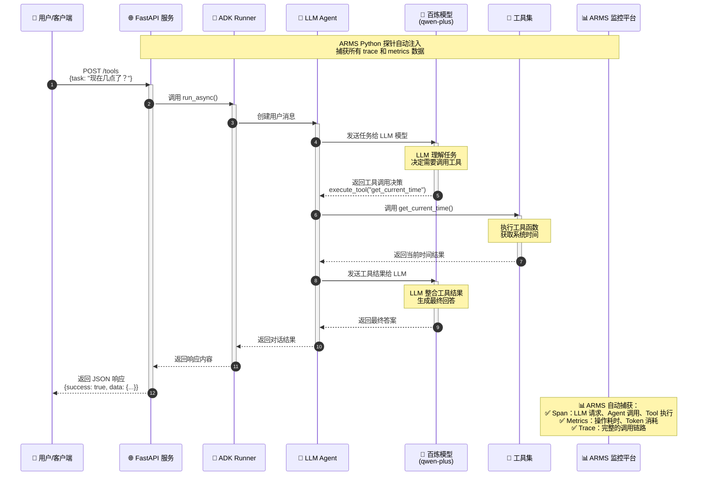

# 使用 ARMS Python 探针监控 Google ADK 应用

更新时间：2025-10-24

## 背景信息

Google ADK (Agent Development Kit) 是 Google 推出的用于构建 GenAI Agent 应用的开发框架。通过 Google ADK，开发者可以快速构建具有工具调用、多轮对话、状态管理等能力的智能 Agent 应用。

ARMS Python 探针是阿里云应用实时监控服务（ARMS）自研的 Python 语言可观测采集探针，基于 OpenTelemetry 标准实现了自动化埋点能力，完整支持 Google ADK 应用的追踪和监控。

将 Google ADK 应用接入 ARMS 后，您可以：
- 查看 Agent 调用链视图，直观分析 Agent 的执行流程
- 监控工具调用（Tool Call）的输入输出和执行耗时
- 追踪 LLM 模型请求的详细信息，包括 Token 消耗、响应时间等
- 实时监控应用性能指标，及时发现和定位问题
- 追踪 A2A 通讯的细节

ARMS 支持的 LLM（大语言模型）推理服务框架和应用框架，请参见 [ARMS 应用监控支持的 Python 组件和框架](https://help.aliyun.com/zh/arms/application-monitoring/user-guide/install-arms-agent-for-python-applications-deployed-in-ack-and-acs)。

## 前提条件

- 已开通 ARMS 服务。如未开通，请参见[开通 ARMS 服务](https://help.aliyun.com/zh/arms/application-monitoring/getting-started/activate-arms)。
- 已安装 Python 3.8 及以上版本。
- 已安装 Google ADK（`google-adk>=0.1.0`）。

## 安装 ARMS Python 探针

根据 Google ADK 应用部署环境选择合适的安装方式：

### 容器环境安装

如果您的应用部署在容器服务 ACK 或容器计算服务 ACS 上，可以通过 ack-onepilot 组件自动安装 ARMS Python 探针。具体操作，请参见[通过 ack-onepilot 组件安装 Python 探针](https://help.aliyun.com/zh/arms/application-monitoring/user-guide/install-the-arms-agent-for-python-applications-deployed-in-container-service-for-kubernetes)。

### 手动安装

1. 安装 ARMS Python 探针：

```bash
pip install aliyun-bootstrap
```

2. 安装 Google ADK 及相关依赖：

```bash
# 安装 Google ADK
pip install google-adk>=0.1.0

# 安装 LLM 客户端库（根据实际使用选择）
pip install litellm  # 用于统一的 LLM API 调用
```

## 接入 ARMS

### 启动应用

使用 ARMS Python 探针启动您的 Google ADK 应用：

```bash
aliyun-instrument python your_adk_app.py
```

**说明**：
- 将 `your_adk_app.py` 替换为您的实际应用入口文件。
- ARMS Python 探针会自动识别 Google ADK 应用并进行埋点。
- 如果您暂时没有可接入的 Google ADK 应用，可以使用本文档附录提供的应用 Demo。

### 配置环境变量

在启动应用前，您可以配置以下环境变量：

```bash
# ARMS 接入配置
export ARMS_APP_NAME=xxx   # 应用名称。
export ARMS_REGION_ID=xxx   # 对应的阿里云账号的RegionID。
export ARMS_LICENSE_KEY=xxx   # 阿里云 LicenseKey。

# GenAI 相关配置
export OTEL_INSTRUMENTATION_GENAI_CAPTURE_MESSAGE_CONTENT=true

# 启动应用
aliyun-instrument python your_adk_app.py
```

**配置说明**：
- `APSARA_APM_ACCESS_KEY_ID`：您的阿里云 AccessKey ID
- `APSARA_APM_ACCESS_KEY_SECRET`：您的阿里云 AccessKey Secret
- `APSARA_APM_REGION_ID`：ARMS 服务所在地域，例如 `cn-hangzhou`
- `APSARA_APM_SERVICE_NAME`：应用名称，用于在 ARMS 控制台中标识您的应用

## 执行结果

约一分钟后，若 Google ADK 应用出现在 ARMS 控制台的 **LLM 应用监控** > **应用列表** 页面中且有数据上报，则说明接入成功。

<!-- 截图位置：ARMS 控制台 LLM 应用列表 -->
**图 1：ARMS 控制台 - LLM 应用列表**

[预留截图位置]

---

## 查看监控数据

### 调用链视图

在 ARMS 控制台的 **LLM 应用监控** > **调用链** 页面，您可以查看 Google ADK 应用的详细调用链路：

<!-- 截图位置：调用链列表 -->
**图 2：Google ADK 应用调用链列表**

[预留截图位置]

---

点击具体的调用链，可以查看完整的 Span 信息，包括：

- **Agent Span**：Agent 执行的完整流程
  - `gen_ai.operation.name`: `invoke_agent`
  - `gen_ai.agent.name`: Agent 名称
  - `gen_ai.agent.description`: Agent 描述
  - `gen_ai.conversation.id`: 会话 ID
  - `enduser.id`: 用户 ID

- **LLM Span**：模型调用详情
  - `gen_ai.operation.name`: `chat`
  - `gen_ai.provider.name`: 模型提供商
  - `gen_ai.request.model`: 请求模型名称
  - `gen_ai.response.model`: 响应模型名称
  - `gen_ai.usage.input_tokens`: 输入 Token 数
  - `gen_ai.usage.output_tokens`: 输出 Token 数
  - `gen_ai.response.finish_reasons`: 完成原因

- **Tool Span**：工具调用详情
  - `gen_ai.operation.name`: `execute_tool`
  - `gen_ai.tool.name`: 工具名称
  - `gen_ai.tool.description`: 工具描述
  - `gen_ai.tool.call.arguments`: 工具调用参数
  - `gen_ai.tool.call.result`: 工具返回结果

<!-- 截图位置：调用链详情 -->
**图 3：调用链详情 - 展示 Agent、LLM、Tool 的层级关系**

[预留截图位置]

---

### 性能指标

在 **LLM 应用监控** > **指标** 页面，您可以查看应用的性能指标：

#### 调用次数（genai_calls_count）

- **指标类型**：Gauge
- **采集间隔**：1 分钟
- **单位**：次
- **维度**：
  - `modelName`：模型名称
  - `spanKind`：Span 类型（LLM、AGENT、TOOL）
  - `service`：服务名称
  - `rpc`：调用名称

<!-- 截图位置：调用次数统计图表 -->
**图 4：GenAI 调用次数统计**

[预留截图位置]

---

#### 响应耗时（genai_calls_duration_seconds）

- **指标类型**：Gauge
- **采集间隔**：1 分钟
- **单位**：秒
- **维度**：
  - `modelName`：模型名称
  - `spanKind`：Span 类型（LLM、AGENT、TOOL）
  - `service`：服务名称
  - `rpc`：调用名称

<!-- 截图位置：响应耗时分布图表 -->
**图 5：GenAI 响应耗时分布**

[预留截图位置]

---

#### Token 使用量（genai_llm_usage_tokens）

- **指标类型**：Gauge
- **采集间隔**：1 分钟
- **单位**：token
- **维度**：
  - `modelName`：模型名称
  - `spanKind`：Span 类型（通常为 LLM）
  - `usageType`：Token 类型（input、output）
  - `service`：服务名称
  - `rpc`：调用名称

<!-- 截图位置：Token 使用量图表 -->
**图 6：Token 使用量统计**

[预留截图位置]

---

#### 首包响应时间（genai_llm_first_token_seconds）

- **指标类型**：Gauge
- **采集间隔**：1 分钟
- **单位**：秒
- **说明**：从 LLM 请求发出到收到第一个 Token 的耗时（TTFT - Time To First Token）
- **维度**：
  - `modelName`：模型名称
  - `spanKind`：Span 类型（LLM）
  - `service`：服务名称
  - `rpc`：调用名称

<!-- 截图位置：首包响应时间图表 -->
**图 7：LLM 首包响应时间**

[预留截图位置]

---

#### 错误统计（genai_calls_error_count）

- **指标类型**：Gauge
- **采集间隔**：1 分钟
- **单位**：次
- **维度**：
  - `modelName`：模型名称
  - `spanKind`：Span 类型（LLM、AGENT、TOOL）
  - `service`：服务名称
  - `rpc`：调用名称

<!-- 截图位置：错误统计图表 -->
**图 8：GenAI 错误统计**

[预留截图位置]

---

#### 慢调用统计（genai_calls_slow_count）

- **指标类型**：Gauge
- **采集间隔**：1 分钟
- **单位**：次
- **维度**：
  - `modelName`：模型名称
  - `spanKind`：Span 类型（LLM、AGENT、TOOL）
  - `service`：服务名称
  - `rpc`：调用名称

<!-- 截图位置：慢调用统计图表 -->
**图 9：GenAI 慢调用统计**

[预留截图位置]

---

### LLM 调用链分析

ARMS 提供专门的 LLM 调用链分析功能，支持：

- **输入输出分析**：查看每次 LLM 调用的完整 prompt 和 response
- **Token 成本分析**：统计和分析 Token 消耗情况
- **性能分析**：分析响应时间、首 Token 时间等性能指标
- **错误分析**：快速定位和诊断 LLM 调用错误

更多信息，请参见 [LLM 调用链分析](https://help.aliyun.com/zh/arms/application-monitoring/user-guide/llm-call-chain-analysis)。

<!-- 截图位置：LLM 调用链分析页面 -->
**图 6：LLM 调用链分析**

[预留截图位置]

---

## 配置选项

### 输入/输出内容采集

**默认值**：`False`，默认不采集详细内容。

**配置说明**：
- 开启后：采集 Agent、Tool、LLM 的完整输入输出内容
- 关闭后：仅采集字段大小，不采集字段内容

**配置方式**：

```bash
export OTEL_INSTRUMENTATION_GENAI_CAPTURE_MESSAGE_CONTENT=true
```

**注意**：采集内容可能包含敏感信息，请根据实际需求和安全要求决定是否开启。

### 消息内容字段长度限制

**默认值**：4096 字符

**配置说明**：限制每条消息内容的最大长度，超过限制的内容将被截断。

**配置方式**：

```bash
export OTEL_INSTRUMENTATION_GENAI_MESSAGE_CONTENT_MAX_LENGTH=8192
```

### Span 属性值长度限制

**默认值**：无限制

**配置说明**：限制上报的 Span 属性值（如 `gen_ai.agent.description`）的长度，超过限制的内容将被截断。

**配置方式**：

```bash
export OTEL_SPAN_ATTRIBUTE_VALUE_LENGTH_LIMIT=4096
```

### 应用类型指定

ARMS Python 探针会自动识别应用类型，但您也可以手动指定：

```bash
# app: 大语言模型应用
export APSARA_APM_APP_TYPE=app
```

## 语义规范说明

ARMS Python 探针完全遵循 OpenTelemetry GenAI 语义规范，确保监控数据的标准化和可移植性。

### Trace 语义规范

**Span 命名规范**：
- LLM 操作：`chat {model}`，例如 `chat gemini-pro`
- Agent 操作：`invoke_agent {agent_name}`，例如 `invoke_agent math_tutor`
- Tool 操作：`execute_tool {tool_name}`，例如 `execute_tool get_weather`

**标准 Attributes**：
- `gen_ai.operation.name`：操作类型（必需）
- `gen_ai.provider.name`：提供商名称（必需）
- `gen_ai.conversation.id`：会话 ID（替代旧版 `gen_ai.session.id`）
- `enduser.id`：用户 ID（替代旧版 `gen_ai.user.id`）
- `gen_ai.response.finish_reasons`：完成原因（数组格式）

更多信息，请参见：
- [GenAI Spans](https://github.com/open-telemetry/semantic-conventions/blob/main/docs/gen-ai/gen-ai-spans.md)
- [GenAI Agent Spans](https://github.com/open-telemetry/semantic-conventions/blob/main/docs/gen-ai/gen-ai-agent-spans.md)

### ARMS 监控指标

ARMS Python 探针会自动采集以下 GenAI 相关指标：

#### 1. genai_calls_count
- **指标类型**：Gauge
- **采集间隔**：1 分钟
- **单位**：次
- **说明**：各种 GenAI 相关调用的请求次数
- **维度**：
  - `modelName`：模型名称（必需）
  - `spanKind`：Span 类型（必需），如 `LLM`、`AGENT`、`TOOL`
  - `pid`：应用 ID
  - `service`：服务名称
  - `serverIp`：机器 IP
  - `rpc`：调用名称（spanName）

#### 2. genai_calls_duration_seconds
- **指标类型**：Gauge
- **采集间隔**：1 分钟
- **单位**：秒
- **说明**：各种 GenAI 相关调用的响应耗时
- **维度**：
  - `modelName`：模型名称（必需）
  - `spanKind`：Span 类型（必需）
  - 以及其他公共维度（pid、service、serverIp、rpc）

#### 3. genai_calls_error_count
- **指标类型**：Gauge
- **采集间隔**：1 分钟
- **单位**：次
- **说明**：各种 GenAI 相关调用的错误次数
- **维度**：
  - `modelName`：模型名称（必需）
  - `spanKind`：Span 类型（必需）
  - 以及其他公共维度（pid、service、serverIp、rpc）

#### 4. genai_calls_slow_count
- **指标类型**：Gauge
- **采集间隔**：1 分钟
- **单位**：次
- **说明**：各种 GenAI 相关调用的慢调用次数
- **维度**：
  - `modelName`：模型名称（必需）
  - `spanKind`：Span 类型（必需）
  - 以及其他公共维度（pid、service、serverIp、rpc）

#### 5. genai_llm_first_token_seconds
- **指标类型**：Gauge
- **采集间隔**：1 分钟
- **单位**：秒
- **说明**：调用 LLM 首包响应耗时（从请求到第一个响应返回的耗时）
- **适用范围**：大模型应用和模型服务
- **维度**：
  - `modelName`：模型名称（必需）
  - `spanKind`：Span 类型（必需）
  - 以及其他公共维度（pid、service、serverIp、rpc）

#### 6. genai_llm_usage_tokens
- **指标类型**：Gauge
- **采集间隔**：1 分钟
- **单位**：token
- **说明**：Tokens 消耗统计
- **维度**：
  - `modelName`：模型名称（必需）
  - `spanKind`：Span 类型（必需）
  - `usageType`：用途类型（必需），取值为 `input` 或 `output`
  - 以及其他公共维度（pid、service、serverIp、rpc）

#### 公共维度说明

所有 GenAI 指标都包含以下公共维度：

| 维度Key | 维度描述 | 类型 | 示例 | 需求等级 |
|--------|---------|------|------|---------|
| `pid` | 应用 ID | string | `ggxw4lnjuz@0cb8619bb54****` | 必须 |
| `service` | 服务名称 | string | `llm-rag-demo` | 必须 |
| `serverIp` | 应用对应机器 IP | string | `127.0.0.1` | 可选 |
| `rpc` | 调用名称（spanName），工具调用为 toolName | string | `/query` | 必须 |
| `source` | 用户来源 | string | `apm` | 必须 |
| `acs_cms_workspace` | 云监控 Workspace | string | `arms-test` | 有条件时必须 |
| `acs_arms_service_id` | 云监控服务 ID | string | `ggxw4lnjuz@b63ba5a1d60b517ae374f` | 有条件时必须 |

**注意**：
- `source` 取值为 `apm`（ARMS 应用实时监控服务）或 `xtrace`（可观测链路 OpenTelemetry 版）
- `spanKind` 用于区分不同类型的 GenAI 操作：`LLM`（大模型调用）、`AGENT`（Agent 调用）、`TOOL`（工具调用）等
- 所有指标均为大模型调用记录为内部调用（CallType: `internal`），通过 `spanKind` 进行聚合

## 附录：Demo 示例

### 示例程序架构流程图

本章节的示例程序基于 Google ADK 框架，实现了一个完整的工具使用 Agent HTTP 服务。以下是其核心执行流程：



**流程说明：**

1. **用户请求**：客户端通过 HTTP POST 请求发送任务到 FastAPI 服务（如"现在几点了？"）
2. **ADK Runner 处理**：Runner 接收请求并创建用户消息
3. **Agent 协调**：Agent 将任务发送给 LLM 模型进行理解
4. **LLM 决策**：LLM 分析任务并决定需要调用 `get_current_time()` 工具
5. **工具执行**：Agent 调用相应的工具函数获取当前时间
6. **结果整合**：Agent 将工具返回的结果再次发送给 LLM
7. **生成回答**：LLM 基于工具结果生成最终的自然语言回答
8. **响应返回**：完整的响应通过 FastAPI 返回给客户端
9. **ARMS 监控**：整个过程中，ARMS Python 探针自动捕获所有的 Trace、Span 和 Metrics 数据

**可用工具集：**

本示例程序集成了 7 个工具函数，展示了 Agent 的多种能力：

| 工具名称 | 功能描述 | 示例任务 |
|---------|---------|---------|
| 🕐 `get_current_time` | 获取当前时间 | "现在几点了？" |
| 🧮 `calculate_math` | 数学表达式计算 | "计算 123 * 456" |
| 🎲 `roll_dice` | 掷骰子（可指定面数） | "掷一个六面骰子" |
| 🔢 `check_prime_numbers` | 质数检查 | "检查 17, 25, 29 是否为质数" |
| 🌤️ `get_weather_info` | 获取天气信息（模拟） | "北京的天气怎么样？" |
| 🔍 `search_web` | 网络搜索（模拟） | "搜索人工智能的定义" |
| 🌍 `translate_text` | 文本翻译（模拟） | "翻译'你好'成英文" |

**ARMS 监控维度：**

探针会自动为以下操作生成对应的 Span 和 Metrics：

**Span 数据：**
- **LLM 请求 Span**：包含模型名称、Token 消耗、响应时间等
- **Agent 调用 Span**：包含 Agent 名称、操作类型、会话 ID 等
- **Tool 执行 Span**：包含工具名称、参数、返回值等

**Metrics 数据：**
- **genai_calls_count**：GenAI 调用请求次数（按 spanKind 区分：LLM、AGENT、TOOL）
- **genai_calls_duration_seconds**：GenAI 调用响应耗时
- **genai_calls_error_count**：GenAI 调用错误次数
- **genai_calls_slow_count**：GenAI 慢调用次数
- **genai_llm_first_token_seconds**：LLM 首包响应耗时（TTFT）
- **genai_llm_usage_tokens**：Token 消耗统计（区分 input/output）

完整的示例代码请参见项目的 `examples/` 目录（[main.py](../examples/main.py) 和 [tools.py](../examples/tools.py)）。

### Google ADK 基础示例

本示例演示如何创建一个简单的 Google ADK Agent 应用。

#### 应用代码（adk_app.py）

```python
"""
Google ADK Demo Application
演示 Agent、Tool、LLM 的集成使用
"""
from google.adk.agents import Agent
from google.adk.tools import Tool, FunctionTool
from google.adk.runners import Runner
from datetime import datetime
import json


# 定义工具函数
def get_current_time() -> str:
    """获取当前时间"""
    return datetime.now().strftime("%Y-%m-%d %H:%M:%S")


def calculate(expression: str) -> str:
    """
    计算数学表达式
    
    Args:
        expression: 数学表达式，例如 "2 + 3"
    """
    try:
        result = eval(expression)
        return f"计算结果：{result}"
    except Exception as e:
        return f"计算错误：{str(e)}"


# 创建 Tools
time_tool = FunctionTool(
    name="get_current_time",
    description="获取当前时间",
    func=get_current_time
)

calculator_tool = FunctionTool(
    name="calculate",
    description="计算数学表达式，支持加减乘除等基本运算",
    func=calculate
)

# 创建 Agent
math_assistant = Agent(
    name="math_assistant",
    description="一个能够执行数学计算和查询时间的智能助手",
    tools=[time_tool, calculator_tool],
    model="gemini-1.5-flash",  # 或使用其他支持的模型
    system_instruction="你是一个专业的数学助手，可以帮助用户进行计算和查询时间。"
)

# 创建 Runner
runner = Runner(agent=math_assistant)


def main():
    """主函数"""
    print("Google ADK Demo - Math Assistant")
    print("=" * 50)
    
    # 测试场景 1：计算
    print("\n场景 1：数学计算")
    result1 = runner.run("帮我计算 (125 + 375) * 2 的结果")
    print(f"用户：帮我计算 (125 + 375) * 2 的结果")
    print(f"助手：{result1}")
    
    # 测试场景 2：查询时间
    print("\n场景 2：查询时间")
    result2 = runner.run("现在几点了？")
    print(f"用户：现在几点了？")
    print(f"助手：{result2}")
    
    # 测试场景 3：组合使用
    print("\n场景 3：组合使用")
    result3 = runner.run("现在几点了？顺便帮我算一下 100 / 4")
    print(f"用户：现在几点了？顺便帮我算一下 100 / 4")
    print(f"助手：{result3}")
    
    print("\n" + "=" * 50)
    print("Demo 完成")


if __name__ == "__main__":
    main()
```

#### 依赖文件（requirements.txt）

```txt
google-adk>=0.1.0
litellm
aliyun-python-agent
```

#### 运行方式

```bash
# 1. 安装依赖
pip install -r requirements.txt

# 2. 配置 ARMS 环境变量
export APSARA_APM_ACCESS_KEY_ID=<您的AccessKey ID>
export APSARA_APM_ACCESS_KEY_SECRET=<您的AccessKey Secret>
export APSARA_APM_REGION_ID=cn-hangzhou
export APSARA_APM_SERVICE_NAME=google-adk-demo

# 3. 配置 GenAI 内容采集
export OTEL_INSTRUMENTATION_GENAI_CAPTURE_MESSAGE_CONTENT=true

# 4. 配置模型 API（根据使用的模型选择）
export GEMINI_API_KEY=<您的 Gemini API Key>
# 或使用 DashScope
export DASHSCOPE_API_KEY=<您的 DashScope API Key>

# 5. 使用 ARMS 探针启动应用
aliyun-instrument python adk_app.py
```

### Google ADK + FastAPI 服务示例

本示例演示如何将 Google ADK Agent 封装为 Web API 服务。

#### 应用代码（adk_api_service.py）

```python
"""
Google ADK + FastAPI Service
将 Google ADK Agent 封装为 RESTful API 服务
"""
from fastapi import FastAPI, HTTPException
from pydantic import BaseModel
from google.adk.agents import Agent
from google.adk.tools import FunctionTool
from google.adk.runners import Runner
import uvicorn
from datetime import datetime


# 定义请求和响应模型
class ChatRequest(BaseModel):
    message: str
    session_id: str = None
    user_id: str = None


class ChatResponse(BaseModel):
    response: str
    session_id: str
    token_usage: dict = None


# 创建 FastAPI 应用
app = FastAPI(title="Google ADK API Service")


# 定义工具
def get_weather(city: str) -> str:
    """获取城市天气（模拟）"""
    # 实际应用中这里应该调用真实的天气API
    return f"{city}的天气：晴，温度25°C"


def search_knowledge(query: str) -> str:
    """搜索知识库（模拟）"""
    # 实际应用中这里应该连接真实的知识库
    return f"关于'{query}'的知识：这是模拟的知识库返回结果"


# 创建 Tools
weather_tool = FunctionTool(
    name="get_weather",
    description="获取指定城市的天气信息",
    func=get_weather
)

knowledge_tool = FunctionTool(
    name="search_knowledge",
    description="搜索内部知识库",
    func=search_knowledge
)

# 创建 Agent
assistant_agent = Agent(
    name="customer_service_agent",
    description="智能客服助手，可以查询天气和搜索知识库",
    tools=[weather_tool, knowledge_tool],
    model="gemini-1.5-flash",
    system_instruction="你是一个专业的客服助手，态度友好，回答准确。"
)

# 创建 Runner
runner = Runner(agent=assistant_agent)


# API 端点
@app.get("/")
def root():
    """健康检查"""
    return {
        "service": "Google ADK API Service",
        "status": "running",
        "timestamp": datetime.now().isoformat()
    }


@app.post("/chat", response_model=ChatResponse)
def chat(request: ChatRequest):
    """
    处理聊天请求
    
    Args:
        request: 包含用户消息和会话信息的请求
        
    Returns:
        ChatResponse: 包含 Agent 响应的结果
    """
    try:
        # 执行 Agent
        response = runner.run(
            request.message,
            session_id=request.session_id,
            user_id=request.user_id
        )
        
        return ChatResponse(
            response=response,
            session_id=request.session_id or "default",
            token_usage={"note": "Token usage info would be here"}
        )
    except Exception as e:
        raise HTTPException(status_code=500, detail=str(e))


@app.get("/health")
def health():
    """健康检查端点"""
    return {"status": "healthy"}


if __name__ == "__main__":
    # 启动服务
    uvicorn.run(
        app,
        host="0.0.0.0",
        port=8000,
        log_level="info"
    )
```

#### 依赖文件（requirements.txt）

```txt
google-adk>=0.1.0
fastapi
uvicorn[standard]
pydantic
litellm
aliyun-python-agent
```

#### 运行方式

```bash
# 1. 安装依赖
pip install -r requirements.txt

# 2. 配置环境变量
export APSARA_APM_ACCESS_KEY_ID=<您的AccessKey ID>
export APSARA_APM_ACCESS_KEY_SECRET=<您的AccessKey Secret>
export APSARA_APM_REGION_ID=cn-hangzhou
export APSARA_APM_SERVICE_NAME=google-adk-api-service
export OTEL_INSTRUMENTATION_GENAI_CAPTURE_MESSAGE_CONTENT=true
export GEMINI_API_KEY=<您的 Gemini API Key>

# 3. 使用 ARMS 探针启动服务
aliyun-instrument python adk_api_service.py
```

#### 测试 API

```bash
# 测试健康检查
curl http://localhost:8000/health

# 测试聊天接口
curl -X POST http://localhost:8000/chat \
  -H "Content-Type: application/json" \
  -d '{
    "message": "北京今天天气怎么样？",
    "session_id": "session_001",
    "user_id": "user_123"
  }'
```

## 常见问题

### 1. 应用未出现在 ARMS 控制台

**问题排查**：
- 检查 AccessKey 配置是否正确
- 检查地域（Region ID）配置是否正确
- 检查网络连接，确保应用可以访问 ARMS 服务端点
- 查看应用日志，确认探针是否正常启动

### 2. 调用链数据缺失

**问题排查**：
- 检查 `OTEL_INSTRUMENTATION_GENAI_CAPTURE_MESSAGE_CONTENT` 配置
- 确认 Google ADK 版本是否符合要求（>=0.1.0）
- 检查是否有异常或错误日志

### 3. Token 使用量数据为空

**可能原因**：
- 部分模型可能不返回 Token 使用量信息
- 需要确保模型 API 响应中包含 usage 信息

### 4. 性能影响

**说明**：
- ARMS Python 探针采用异步上报机制，对应用性能影响极小（通常 < 1%）
- 如需进一步降低影响，可以关闭内容采集：`OTEL_INSTRUMENTATION_GENAI_CAPTURE_MESSAGE_CONTENT=false`

## 相关文档

- [ARMS 应用监控概述](https://help.aliyun.com/zh/arms/application-monitoring/user-guide/application-monitoring-overview)
- [LLM 调用链分析](https://help.aliyun.com/zh/arms/application-monitoring/user-guide/llm-call-chain-analysis)
- [ARMS Python 探针总览](https://help.aliyun.com/zh/arms/application-monitoring/user-guide/use-the-arms-agent-for-python-to-monitor-llm-applications)
- [OpenTelemetry GenAI 语义规范](https://github.com/open-telemetry/semantic-conventions/blob/main/docs/gen-ai/)
- [Google ADK 官方文档](https://google.github.io/adk-docs/)

## 技术支持

如果您在使用过程中遇到问题，可以通过以下方式获取帮助：

- 提交工单：在阿里云控制台提交技术支持工单
- 钉钉群：加入 ARMS 技术交流群
- 文档反馈：通过文档页面的反馈按钮提交问题

---

**最后更新时间**：2025-10-24  
**文档版本**：v1.0

